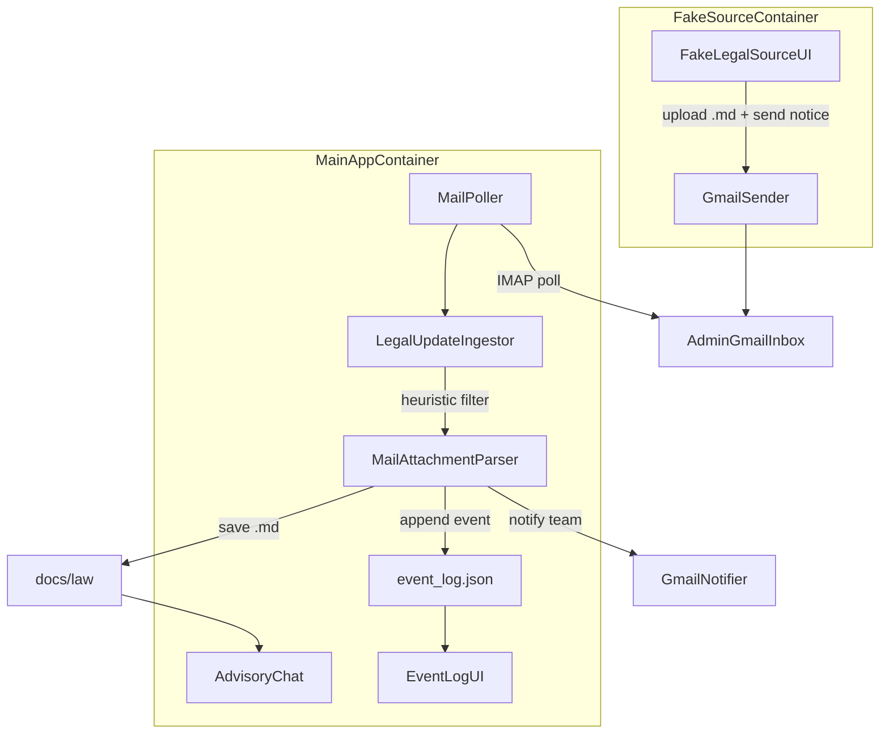

# AI Legal MVP

Agentic, filesystem-grounded legal assistant: **LangGraph / Deep Agents** read markdown under `docs/` to answer with citations, while an optional **Gmail automation** stack ingests new law files from a fake *thuvienphapluat.vn* publisher into `docs/law` and records runs on `/events`.

For the full product plan and rationale, see [`automation design.md`](automation%20design.md).

## Target architecture

The demo is intentionally split: **advisory + ingestion** live in one process (`main-app`), the **fake legal source** in another (`fake-source-app`), both under Docker Compose. Email uses real Gmail (SMTP send, IMAP poll, App Passwords)—no Pub/Sub or webhooks.



### Locked assumptions (summary)

- Chat stays at `/`; the fake source is **not** mounted on the same service—`fake-source-app` is publisher-only.
- New laws land as normal files under `docs/law` (overwrites update in place). Indexes refresh via `doc_index` / `ensure_doc_indexes()` after ingest.
- Event log and mail cursor are **JSON files** in `data/`, not a database.
- **Heuristics** (sender, subject/body keywords, `.md` attachments) gate ingestion—no LLM classifier in the mail path.
- See [`automation design.md`](automation%20design.md) for module-level detail and the manual verification checklist.

## Project layout

```
app/
├── main.py           # main-app entry (chat, /events, poller)
├── source_main.py    # fake-source-app entry
├── ui.py             # Chat UI
├── agent.py          # Deep Agent + checkpointer + summarization
├── workspace.py      # Agent filesystem workspace
├── doc_index.py      # Markdown indexes under docs/**
├── llm.py
├── prompts.py
├── config.py
└── automation/       # Gmail, poller, ingestor, heuristics, UIs, routes
    ├── config.py
    ├── gmail_client.py
    ├── poller.py
    ├── ingestor.py
    ├── mail_filter.py
    ├── event_store.py
    ├── models.py
    ├── event_ui.py
    ├── source_ui.py
    └── routes.py

docs/
├── law/              # Statutes (including ingested mail)
├── policy/
└── faq/

data/
├── event_log.json    # Automation audit log
└── mail_state.json   # Dedup + IMAP UID cursor + inbox baseline
```

## Quick start

### Local advisory app only

```bash
cp .env.example .env
# Set OPENAI_API_KEY (and model-related vars as needed)

uv sync
uv run -m app.main
```

Open [http://localhost:8080](http://localhost:8080). Set `LEGAL_AUTOMATION_ENABLED=false` in `.env` if you want to disable the poller and mail UI wiring.

### Full automation demo (two apps)

1. Copy `.env.example` to `.env` and set at least: `OPENAI_API_KEY`, `LEGAL_MAIL_SOURCE_EMAIL`, `LEGAL_MAIL_SOURCE_APP_PASSWORD`, `LEGAL_MAIL_ADMIN_EMAIL`, `LEGAL_MAIL_ADMIN_APP_PASSWORD`, `LEGAL_MAIL_TEAM_RECIPIENTS`, and optionally `LEGAL_AUTOMATION_ENABLED=true`.
2. Enable IMAP on the admin mailbox and use **Gmail App Passwords** for both mail accounts.
3. Start the stack:

```bash
docker compose up --build
```

Then open:

- [http://localhost:8080](http://localhost:8080) — advisory chat and `/events`
- [http://localhost:8081](http://localhost:8081) — fake *thuvienphapluat* portal (upload + send)

Shared volumes: `docs/`, `.generated_docs/`, `demo_memory/`, and `data/` (see `docker-compose.yml`).

## Ingestion behavior (mail)

- **IMAP polling** on an interval (default 15s); no Gmail `watch` / Pub/Sub.
- **Deduplication** by message id plus tracked state in `mail_state.json`.
- **Inbox baseline**: on first run with no prior UID watermark, the poller sets the cursor to the **current highest inbox UID** so **existing** mail in the box is not bulk-ingested; only **new** messages (higher UIDs) are candidates afterward. Restarts keep the same cursor.
- Heuristic pass/fail: **ignored** events are logged; matching `.md` attachments are written, indexed, and the Legal team can be notified by SMTP.

## Benchmark

```bash
uv run python benchmark.py
```

Runs a small fixed set of questions (law + policy) against the loaded corpus.

## Features

- **Docs-grounded answers**: agent reads real files, not a vector RAG layer.
- **Citation-aware** responses tied to source paths and sections.
- **Session memory**: LangGraph `InMemorySaver` + browser `session_id` as `thread_id`.
- **Context summarization**: when context exceeds a token threshold, older turns are summarized; recent turns stay verbatim.
- **NiceGUI** chat (Heineken-green theme) and **`/events`** internal ops view: filters, refresh, short auto-refresh.
- **Fake source app**: send realistic legal-update mail with `.md` attachments to the admin inbox.
- **Background poller** in `main-app`: fetch → heuristics → `docs/law` + `event_log.json` + team notifications.
- **Benchmark script** for quick regression checks on Q&A.

## Memory

- **Checkpointer**: `InMemorySaver` persists per-thread state; `thread_id` is the browser `session_id`.
- **Summarization**: Deep Agents summarization middleware when context exceeds the trigger (see `app/config.py`: `CONTEXT_SUMMARIZE_TRIGGER_TOKENS`, `CONTEXT_KEEP_MESSAGES`).
- **Sessions** are isolated; different browser sessions do not share memory.

## Demo flow (manual)

1. In the fake-source app, upload a `.md` law and send a legal update.
2. Confirm the message reaches the admin Gmail inbox.
3. After the poller runs, check `docs/law`, `/events`, and ask the chat on `/` about the new file.

Step-by-step expectations are also listed in [`automation design.md`](automation%20design.md) (Testing and verification).
