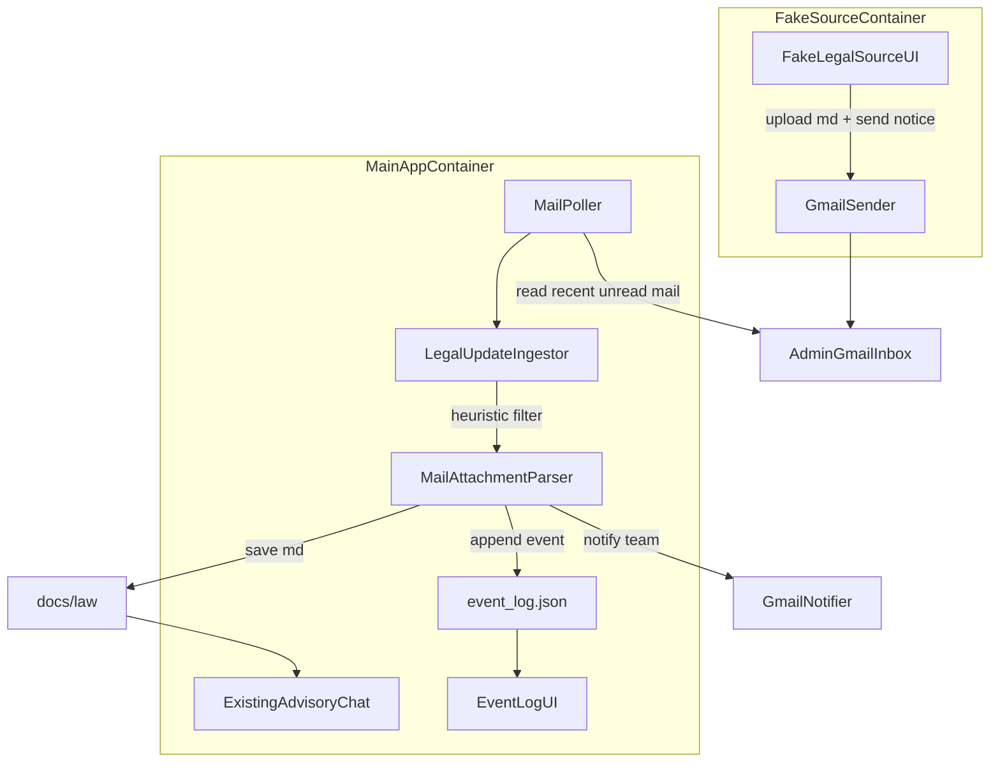

# Legal Automation Demo Plan

## Design Review

The proposed architecture is still sound for the demo after replacing Outlook with Gmail.

- The strongest part remains the separation between advisory and automation. The current chatbot already reads all markdown under `[/root/ai-legal-2/docs](/root/ai-legal-2/docs)` via `[/root/ai-legal-2/app/prompts.py](/root/ai-legal-2/app/prompts.py)` and regenerates indexes from `[/root/ai-legal-2/app/doc_index.py](/root/ai-legal-2/app/doc_index.py)`, so pushing new `.md` laws into `docs/law` lets chat benefit automatically without exposing the ingestion flow to end users.
- The easiest implementation path for the demo is not webhook-based Gmail. It is Gmail with `SMTP` for sending, `IMAP` for reading, an App Password for authentication, and a short background polling loop. That removes the need for Google Cloud Pub/Sub, public HTTPS callbacks, and watch-renewal logic.
- This is slightly less production-like than a push-notification architecture, but it is the lowest-friction route to a working demo that can be started locally with Docker Compose.
- For demo ergonomics, the UI should be split into two containers: the main app container serves the user-facing chat and internal `/events` page, while the fake legal-source UI runs separately as an isolated publisher-only surface.

## Locked Assumptions

- Keep the existing chat page at `[/root/ai-legal-2/app/ui.py](/root/ai-legal-2/app/ui.py)` working unchanged for end users.
- New legal documents are written directly into `docs/law` as normal markdown files. If a filename already exists, overwrite that path and record the replacement in the event log.
- Event log storage is a JSON file, not a database.
- The demo uses a fake legal-source UI, but real Gmail delivery to the admin inbox and real notification emails to Legal team recipients.
- Heuristics, not an LLM, decide whether an incoming email is a relevant legal update.
- Gmail access will use App Passwords with SMTP/IMAP enabled on the participating Gmail accounts.
- Container layout is fixed to two services: one main app container for advisory chat + event monitoring + background mail ingestion, and one fake-source container for legal document publishing.

## Target Architecture

The demo should run as two containers under one `docker compose` stack:

- `main-app`: the real demo surface for end users and Legal team members. It hosts `/` for advisory chat, `/events` for event monitoring, and the Gmail polling worker.
- `fake-source-app`: a separate demo-only UI that simulates `thuvienphapluat.vn` and sends legal update emails into the system.

## Implementation Approach

### 1. Preserve existing advisory flow

Use the current app as the host shell for the main container:

- `[/root/ai-legal-2/app/main.py](/root/ai-legal-2/app/main.py)` already starts NiceGUI on port `8080`.
- `[/root/ai-legal-2/app/ui.py](/root/ai-legal-2/app/ui.py)` already serves `/` and `POST /api/upload`.
- `[/root/ai-legal-2/app/doc_index.py](/root/ai-legal-2/app/doc_index.py)` already rebuilds markdown indexes recursively under `docs/**.md`.

Plan: keep `/` as-is in the main app, then add:

- `/events` in the main app for the internal event log UI.
- a separate fake-source app/container for the legal-source publishing UI rather than mounting `/source` inside the same service.

### 2. Add a dedicated automation service layer

Create new backend modules rather than stuffing logic into `app/ui.py`. Keep a clean separation between code that belongs to the main app container and code that belongs to the fake-source container.

Suggested module split:

- `[/root/ai-legal-2/app/automation/config.py](/root/ai-legal-2/app/automation/config.py)`: Gmail credentials, mailbox addresses, poll intervals, log/data paths.
- `[/root/ai-legal-2/app/automation/models.py](/root/ai-legal-2/app/automation/models.py)`: typed event records and status enums.
- `[/root/ai-legal-2/app/automation/event_store.py](/root/ai-legal-2/app/automation/event_store.py)`: JSON-backed append/read/update helpers.
- `[/root/ai-legal-2/app/automation/gmail_client.py](/root/ai-legal-2/app/automation/gmail_client.py)`: SMTP send, IMAP read, attachment decoding, and basic mailbox helpers.
- `[/root/ai-legal-2/app/automation/poller.py](/root/ai-legal-2/app/automation/poller.py)`: periodic inbox scan, dedup lookup, retry handling, and worker lifecycle.
- `[/root/ai-legal-2/app/automation/mail_filter.py](/root/ai-legal-2/app/automation/mail_filter.py)`: heuristics for deciding whether an email represents a legal document update.
- `[/root/ai-legal-2/app/automation/ingestor.py](/root/ai-legal-2/app/automation/ingestor.py)`: end-to-end processing from a fetched Gmail message to saved file + event log + Legal team notification.
- `[/root/ai-legal-2/app/automation/routes.py](/root/ai-legal-2/app/automation/routes.py)`: REST endpoints for manual trigger/testing and event UI data access.
- `[/root/ai-legal-2/app/automation/source_ui.py](/root/ai-legal-2/app/automation/source_ui.py)`: fake `thuvienphapluat` upload/send page for the separate fake-source container.
- `[/root/ai-legal-2/app/automation/event_ui.py](/root/ai-legal-2/app/automation/event_ui.py)`: event log page.
- `[/root/ai-legal-2/app/source_main.py](/root/ai-legal-2/app/source_main.py)` or equivalent separate entrypoint: starts the fake-source container UI.

Rename `Event Fetcher` to `Legal Update Ingestor`. It better reflects the real job: receive mail signal, verify relevance, ingest attachment, update storage, and notify stakeholders.

### 3. Fake legal-source portal behavior

The fake source page should run in its own container and let the demo operator act as `thuvienphapluat.vn`.

Behavior:

- Upload one markdown file.
- Fill minimal metadata: document title, effective date, optional note.
- Click `Send legal update`.
- App uses Gmail SMTP to send a realistic email with the markdown file attached to the admin Gmail inbox.

This keeps the source site fake while ensuring the downstream mail behavior is real, and it cleanly isolates the publisher demo surface from the user/legal-team-facing app.

### 4. Gmail ingestion flow

Implement the Gmail side using a small background worker instead of webhook infrastructure.

Required behavior:

- Start a background polling task when the app boots.
- Every `10-15` seconds, check the admin Gmail inbox via IMAP for recent unread or newly received messages that match the configured search window.
- Parse message metadata, body, and attachments from the raw email.
- Deduplicate by a stable message identifier in the JSON event store so the same email is never processed twice.
- Mark processed emails as read, or store enough cursor metadata so future polls skip them safely.

Important demo note:

- This design intentionally avoids Google Cloud Pub/Sub, Gmail `watch`, public HTTPS webhooks, and watch renewal. The goal is the simplest end-to-end demo that still uses real email transport.

### 5. Heuristic email classification and ingestion

Keep this intentionally simple and transparent.

Heuristics:

- Sender must match the configured fake-source Gmail address.
- Subject contains configured keywords such as `legal update`, `law`, `privacy`, or Vietnamese equivalents.
- At least one `.md` attachment exists.
- Optional body markers can strengthen confidence.

If heuristics pass:

- Save the attachment into `docs/law/<filename>.md`.
- If the file already exists, overwrite in place.
- Call `ensure_doc_indexes()` from `[/root/ai-legal-2/app/doc_index.py](/root/ai-legal-2/app/doc_index.py)` immediately so advisory search sees the new content.
- Append an event record containing timestamp, message identifier, sender, filename, action (`created` or `updated`), delivery status, and notification recipients.
- Forward a summary email to configured Legal team members via Gmail SMTP.

If heuristics fail:

- Write an `ignored` event with reason, but do not touch `docs/`.

### 6. Event log UI

Build the event log as a new internal page inside the main app container rather than changing the chat UI.

Recommended UX for `/events`:

- Summary cards: total processed, created, updated, ignored, failed.
- Reverse-chronological event list from JSON.
- Per-event fields: time, subject, sender, filename, action, heuristic result, doc path, notification status, and any error.
- Filters: all / processed / ignored / failed.
- Manual refresh button plus short polling timer, similar to the existing sidebar refresh pattern in `[/root/ai-legal-2/app/ui.py](/root/ai-legal-2/app/ui.py)`.

The page should look like an internal ops/audit view, not a chat screen.

### 7. Demo data layout

Add simple file-backed paths under the project root:

- `[/root/ai-legal-2/docs/law](/root/ai-legal-2/docs/law)` for ingested law markdown.
- `[/root/ai-legal-2/data/event_log.json](/root/ai-legal-2/data/event_log.json)` for event storage.
- `[/root/ai-legal-2/data/mail_state.json](/root/ai-legal-2/data/mail_state.json)` for dedup or polling state such as last processed identifiers.
- Optionally `[/root/ai-legal-2/data/sample_mail/](/root/ai-legal-2/data/sample_mail/)` only if fixture-based tests are added.

## Files Most Likely To Change

- `[/root/ai-legal-2/app/main.py](/root/ai-legal-2/app/main.py)`: load new automation modules, expose `/events`, and start the background worker in the main app container.
- `[/root/ai-legal-2/app/ui.py](/root/ai-legal-2/app/ui.py)`: keep `/` chat UI and optionally link to `/events`; do not host fake source UI here.
- `[/root/ai-legal-2/app/doc_index.py](/root/ai-legal-2/app/doc_index.py)`: likely unchanged, but reused after ingestion.
- New `app/automation/*` modules listed above.
- `[/root/ai-legal-2/app/source_main.py](/root/ai-legal-2/app/source_main.py)` or similar separate source-app entrypoint.
- `[/root/ai-legal-2/docker-compose.yml](/root/ai-legal-2/docker-compose.yml)` and one or more Dockerfiles/compose targets for the two services.
- `[/root/ai-legal-2/.env.example](/root/ai-legal-2/.env.example)`: add Gmail-related variables.

## Containerization Plan

Support the requested one-command demo start.

Deliverables:

- `docker-compose.yml` with two services:
  - `main-app`: advisory chat UI, `/events` UI, and background Gmail poller
  - `fake-source-app`: fake legal-source publishing UI
- Shared writable volumes for `docs/`, `.generated_docs/`, `demo_memory/`, and `data/` where needed by the main app.
- Environment variables for OpenAI-compatible LLM and Gmail SMTP/IMAP credentials.
- A clear note that the operator must create Gmail App Passwords first and supply them through env vars.
- Acceptance criteria: after `docker compose up`, both UIs must be reachable immediately without extra bootstrap:
  - main app exposes `/` and `/events`
  - fake-source app exposes its own publishing UI on a separate port or service route
  - background poller starts automatically with the main app container

## Testing And Verification

Keep verification focused and demo-oriented.

- Unit-test heuristic classification and JSON event store behavior.
- Unit-test mail parsing and dedup logic from sample RFC822 messages or mocked IMAP responses.
- Mock the Gmail client for end-to-end ingestion tests: send-like input -> fetch message -> save file -> rebuild index -> append event.
- Manual demo path:
  1. Open the fake-source app, upload a `.md` law, and send update.
  2. Verify admin Gmail inbox receives the message.
  3. Wait for the main-app poller to process the mail and write into `docs/law`.
  4. Verify `/events` in the main app shows the processed event.
  5. Verify `/` in the main app can answer from the newly added law.

## Prerequisites For The Build Agent

The implementation agent should assume these external inputs must be supplied by the operator:

- Source Gmail address and App Password.
- Admin inbox Gmail address and App Password or shared mailbox access strategy.
- Legal team recipient list.
- Gmail IMAP enabled on the receiving mailbox.
- LLM credentials already used by the current advisory demo.

